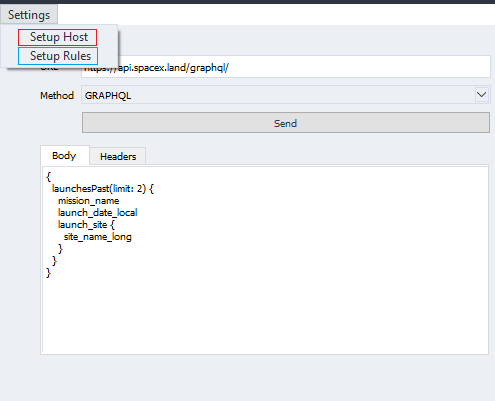
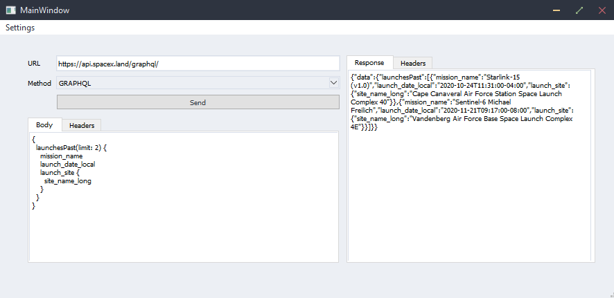

## Usage Example

1. Run the Application

2. Setup Resurface Host and Rules from `settings` menu.

   

3. Send `GET`, `POST` or `GRAPHQL` request.



### Example Requests

URL:

```
https://api.spacex.land/graphql/
```

Method:

```
GRAPHQL
```

Body:

```
{
  launchesPast(limit: 2) {
    mission_name
    launch_date_local
    launch_site {
      site_name_long
    }
  }
}

```

Response

```
{
  "data": {
    "launchesPast": [
      {
        "mission_name": "Starlink-15 (v1.0)",
        "launch_date_local": "2020-10-24T11:31:00-04:00",
        "launch_site": {
          "site_name_long": "Cape Canaveral Air Force Station Space Launch Complex 40"
        }
      },
      {
        "mission_name": "Sentinel-6 Michael Freilich",
        "launch_date_local": "2020-11-21T09:17:00-08:00",
        "launch_site": {
          "site_name_long": "Vandenberg Air Force Base Space Launch Complex 4E"
        }
      }
    ]
  }
}
```
